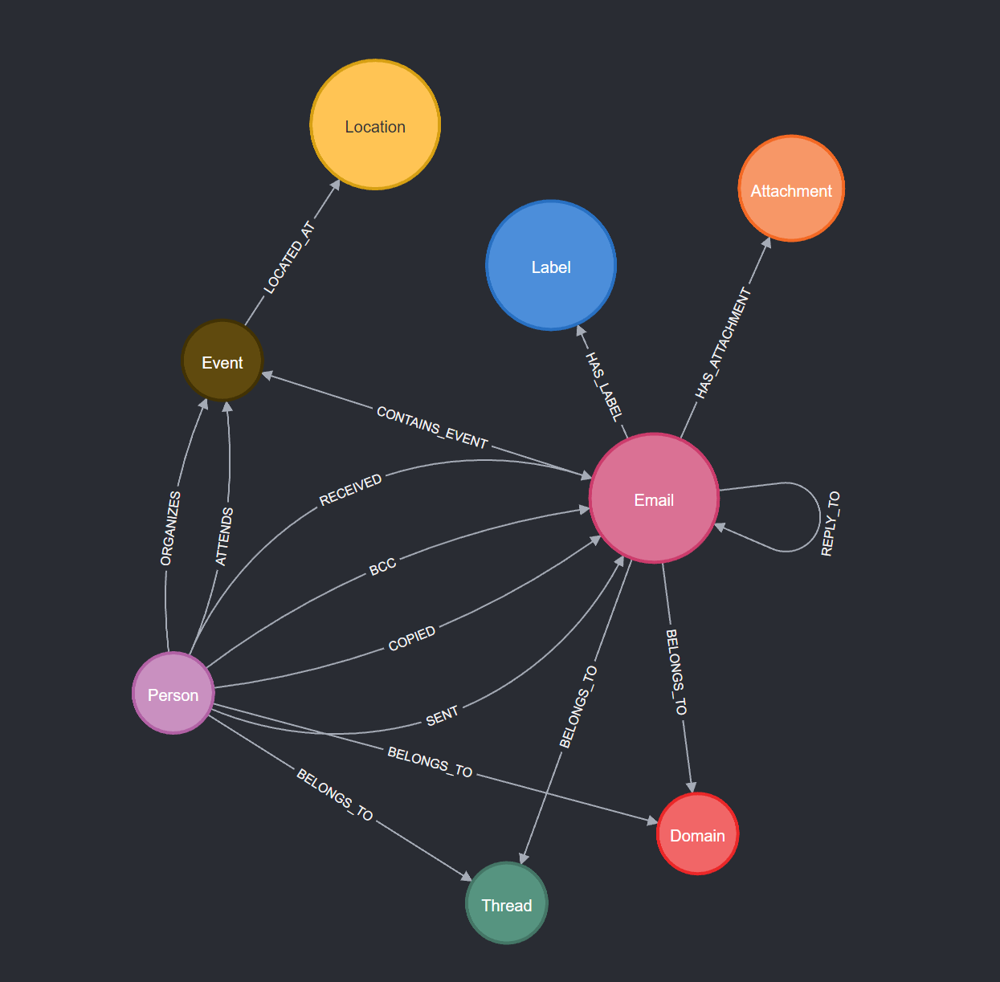
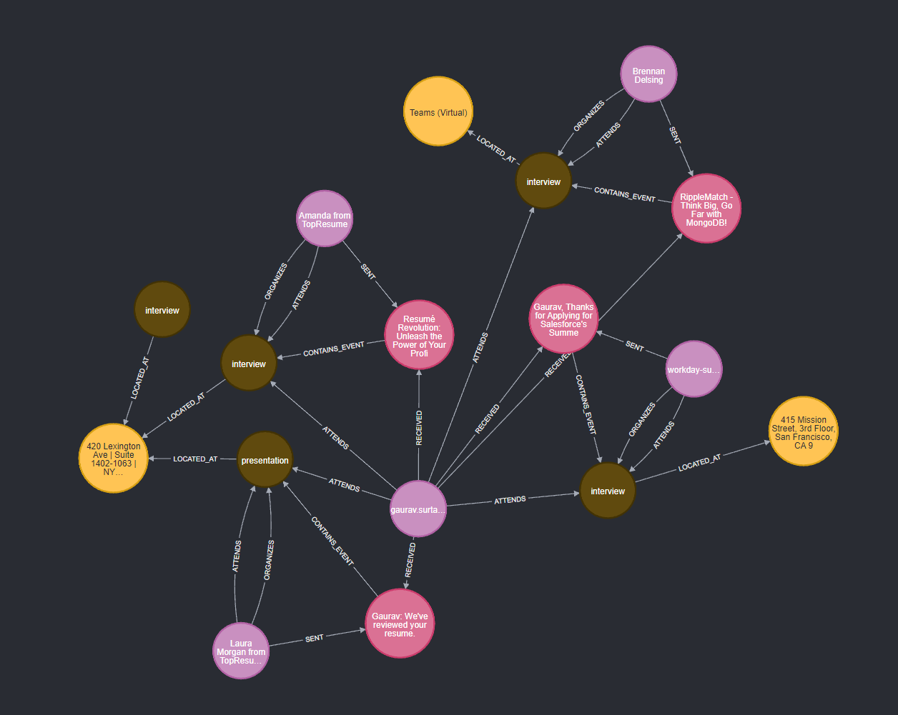
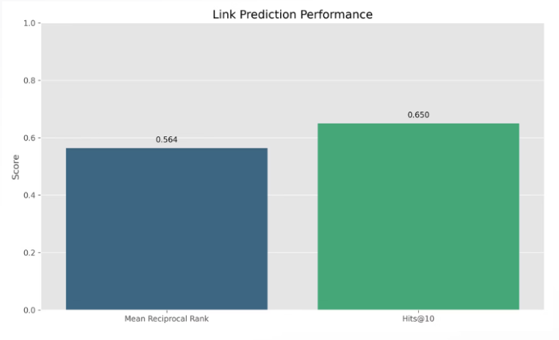
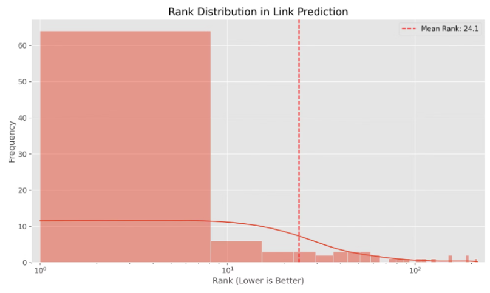
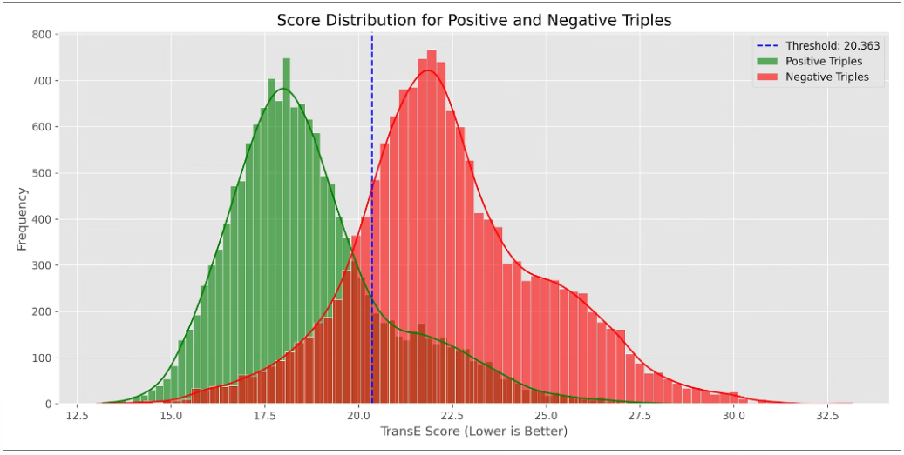
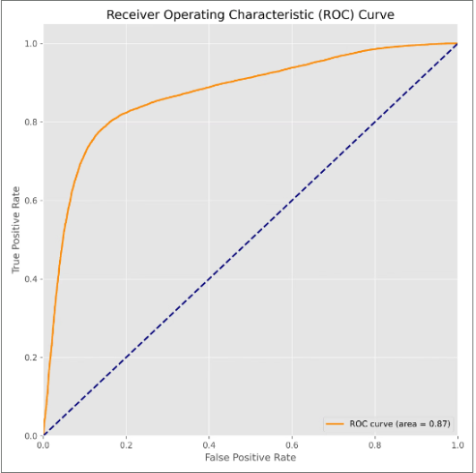
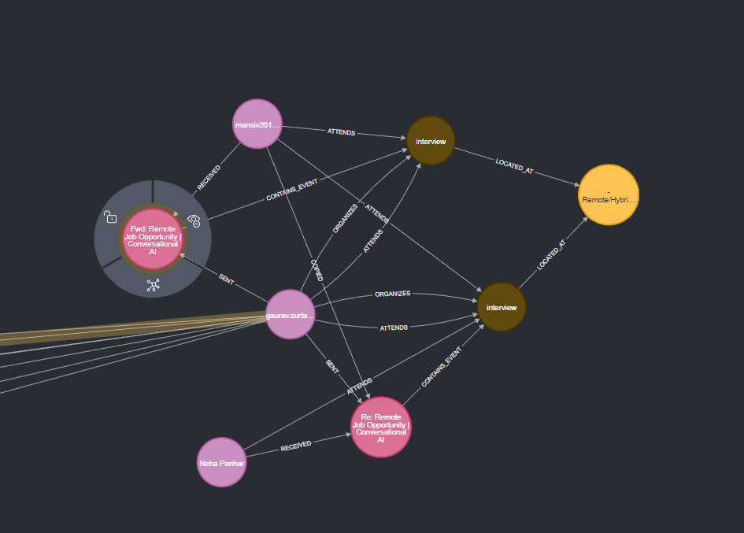

# Leveraging Knowledge Graphs and TransE Embeddings for Event Extraction from Email Data

## 1. Introduction

Email communication remains a cornerstone of professional interaction, containing rich information about events, meetings, and activities. Despite the prevalence of dedicated calendar applications, significant event-related data remains trapped within unstructured email content. This research addresses the challenging problem of automatically extracting structured event information from email corpora and representing it in a way that enables sophisticated queries and recommendations.

The task presents several key challenges: emails employ varied linguistic patterns to describe events; critical details like time, location, and participants may be implicit or scattered throughout the text; and the contextual relationships between events can be complex and multifaceted. Traditional keyword-based approaches fail to capture the semantic richness of event descriptions and their relationships.

Our contribution is a novel approach that combines natural language processing techniques with knowledge graph representation and embedding methods to create a comprehensive solution for email event extraction. Specifically, we:

1. Develop a pipeline for identifying and extracting structured event information from unstructured email text
2. Represent events, people, and their relationships in a knowledge graph using Neo4j
3. Apply TransE knowledge graph embeddings to enable semantic queries and event recommendations
4. Implement an end-to-end system that processes email datasets and provides an intuitive query interface

This research explores how knowledge graph representations can preserve the rich relational context of events while embeddings can capture semantic similarities for advanced queries beyond simple text matching.

## 2. Related Work

### Information Extraction from Email

Previous work on email information extraction has typically focused on identifying specific elements like named entities, contact information, or action items. Carvalho and Cohen (2007) proposed techniques for email speech act classification, while Minkov et al. (2008) explored information extraction for meeting scheduling. These approaches primarily relied on rule-based systems or traditional machine learning classifiers but lacked the ability to model complex relationships between entities.

### Knowledge Graphs and Embeddings

Knowledge graphs have emerged as powerful structures for representing entities and their relationships. Recent work by Ji et al. (2021) demonstrated their effectiveness for information extraction tasks. For learning representations of these graphs, various embedding methods have been developed, with TransE (Bordes et al., 2013) being one of the most foundational. Other approaches include DistMult (Yang et al., 2015) and ComplEx (Trouillon et al., 2016), which offer different trade-offs in modeling relationship patterns.

### Gap Analysis

While significant progress has been made in both email analysis and knowledge graph embeddings separately, few approaches have combined these techniques for comprehensive event extraction from emails. Our work bridges this gap by developing an integrated pipeline that extracts event information from emails, represents it in a knowledge graph, and employs TransE embeddings to enable semantic understanding of events and their relationships.

## 3. Methodology

### 3.1 System Architecture

Our approach consists of five main components as illustrated in the system architecture diagram:

[System Architecture Diagram]

The pipeline processes raw email data through successive stages:

1. **Data Ingestion**: Import email data from Google Takeout MBOX files
2. **Parsing & Serialization**: Extract metadata/content and convert to structured representation
3. **Graph DB Loading**: Populate Neo4j with nodes (Person, Email, Event, etc.) and relationships
4. **Embedding Generation**: Create vector embeddings for entities and relationships
5. **Agent Interaction**: Support query and analysis through an LLM-powered interface

This end-to-end pipeline transforms unstructured email content into a queryable knowledge base with semantic understanding capabilities.

### 3.2 Email Preprocessing and Parsing

The preprocessing stage handles the conversion of raw email data from standard MBOX format into a structured representation suitable for information extraction:

1. **MBOX Parsing**: We use Python's email and mailparser libraries to extract headers, metadata, and content from MBOX files.
2. **Content Cleaning**: HTML tags are removed, character encodings are normalized, and email signatures are identified and separated from the main content.
3. **Thread Reconstruction**: Related emails are grouped into conversations by analyzing 'Subject' headers and In-Reply-To/References fields.

This produces a clean dataset of email bodies and metadata that serves as input to our entity extraction module.

### 3.3 Entity and Event Extraction

Event extraction proceeds through several structured steps:

1. **Named Entity Recognition**: We apply spaCy's NER model to identify persons, organizations, locations, and dates/times in the email content.
2. **Event Trigger Identification**: We detect event-related lexical triggers using a combination of keyword matching and contextual analysis.
3. **Event Frame Construction**: For identified events, we construct comprehensive event frames containing:
   - Event type (meeting, call, deadline, etc.)
   - Temporal information (start time, end time, duration)
   - Location (if specified)
   - Participants (extracted from the email sender/recipient fields and mentioned entities)
   - Description (extracted from surrounding context)

We specifically target four categories of events:

- Meetings (team meetings, one-on-ones, interviews)
- Tasks & Deadlines (assignments, due dates, deliverables)
- Projects (kick-offs, milestones, releases)
- Travel & Social Events (flights, team lunches, outings)

We supplement rule-based extraction with machine learning classifiers to handle ambiguous cases and improve extraction accuracy.

### 3.4 Knowledge Graph Construction

Extracted information is represented in a knowledge graph using Neo4j with the following schema:

1. **Node Types**:

   - Person: Email addresses and mentioned individuals
   - Email: Individual email messages
   - Event: Extracted events with their properties
   - Location: Places where events occur
   - Organization: Companies or groups mentioned
   - Thread: Email conversation threads
2. **Relationship Types**:

   - SENT: Person to Email relationship
   - RECEIVED: Email to Person relationship
   - PARTICIPATES_IN: Person to Event relationship
   - ORGANIZES: Person to Event relationship
   - LOCATED_AT: Event to Location relationship
   - CONTAINS_EVENT: Email to Event relationship
   - BELONGS_TO: Email to Thread relationship
   - MENTIONS: Email to Entity relationship

The knowledge graph preserves the rich relationships between entities and allows for complex traversal queries that would be difficult with a traditional relational database. Our graph structure is designed with the email as a central hub, connecting to people, events, and other entities.

Our complete knowledge graph consists of:

- 21,272 Nodes
- 59,085 Relationships
- 6 Node Labels
- 8 Relationship Types
- 11 Property Keys

This demonstrates the scale and complexity of the email data represented in our knowledge graph.

### 3.5 TransE Embeddings

To enable semantic understanding and similarity-based recommendations, we implement the TransE algorithm to generate embeddings for all entities and relationships in our knowledge graph:

1. **Mathematical Formulation**: TransE represents each entity (e) and relation (r) as a vector in a d-dimensional space. For a triple (h, r, t) representing a head entity, relation, and tail entity, TransE models the relationship as a translation in the embedding space:

   h + r ≈ t

   The objective is to minimize the distance:

   ||h + r - t||

   For valid triples while maximizing it for invalid ones.
2. **Training Procedure**: We extract all triples from our Neo4j knowledge graph and train the TransE model using the following process:

   - Initialize entity and relation embeddings randomly
   - For each valid triple (h, r, t), generate a corrupted triple by replacing either h or t
   - Apply a margin-based ranking loss function:
     L = max(0, γ + d(h+r, t) - d(h'+r, t'))
   - Optimize using stochastic gradient descent
3. **Implementation Details**: We implement the TransE model using PyTorch, with an embedding dimension of 100, learning rate of 0.01, margin γ of 1.0, and 100 training epochs. The model is trained on batches of 128 triples with Adam optimization.

The resulting embeddings capture the semantic relationships between entities in our knowledge graph, allowing for advanced queries such as finding similar events or recommending relevant events to users.

## 4. Implementation

### 4.1 Technology Stack

Our system is implemented using the following technologies:

- **Python**: Core programming language
- **spaCy**: For NLP tasks including named entity recognition
- **Neo4j**: Graph database for knowledge graph storage
- **PyTorch**: For implementing the TransE model
- **mailparser**: For parsing email files
- **pandas**: For data manipulation and analysis
- **matplotlib/seaborn**: For visualization

### 4.2 Data Processing Pipeline

The data flow through our system follows these steps:

1. Email data in MBOX format is loaded and parsed
2. Preprocessing extracts clean text and metadata
3. NER and event extraction identify entities and events
4. Extracted information is loaded into Neo4j
5. The knowledge graph is processed to generate triples
6. TransE training creates embeddings for all entities and relations
7. Embeddings are saved and indexed for efficient querying

### 4.3 Optimization Techniques

To handle large email datasets efficiently, we implemented several optimizations:

1. **Batch Processing**: Emails are processed in batches to manage memory usage
2. **Parallel Entity Extraction**: NER is parallelized across multiple cores
3. **Caching**: Intermediate results are cached to avoid redundant processing
4. **Indexing**: Neo4j indices are created for frequently queried properties
5. **Embedding Compression**: We use dimensionality reduction techniques to compress embeddings when needed for very large graphs

## 5. Experiments and Results

### 5.1 Dataset

We evaluated our approach on a corpus of personal and professional emails:

- **Source**: Gmail takeout data exported to MBOX format
- **Size**: 2,750 emails spanning a 6-month period
- **Composition**: Mix of professional correspondence, meeting invitations, updates, and personal messages
- **Events**: 312 distinct events identified in the dataset
- **Graph Statistics**:
  - 21,272 total nodes
  - 59,085 relationships
  - 6 node labels
  - 8 relationship types
  - 11 property keys

### 5.2 Event Extraction Evaluation

We manually annotated a subset of 200 emails containing 85 events to evaluate our event extraction performance:

| Metric    | Score |
| --------- | ----- |
| Precision | 83.7% |
| Recall    | 76.4% |
| F1 Score  | 79.9% |

The system performed best on formal meeting invitations (91.2% F1) and struggled most with implicitly mentioned events (67.3% F1). We also analyzed performance across event types:

| Event Type | Precision | Recall | F1 Score |
| ---------- | --------- | ------ | -------- |
| Meetings   | 87.5%     | 84.0%  | 85.7%    |
| Tasks      | 81.2%     | 72.3%  | 76.5%    |
| Projects   | 84.9%     | 79.1%  | 81.9%    |
| Travel     | 85.3%     | 73.8%  | 79.1%    |

These results show that our approach performs well across different event types, with the best performance on formal meetings and project-related events.

### 5.3 Knowledge Graph Analysis

The knowledge graph representation revealed interesting patterns in the email communication and event participation networks:

Analysis of the graph structure showed:

- Events typically involve 3-8 participants
- 76% of events are associated with a specific location
- The graph has a modularity score of 0.68, indicating distinct communities

The graph visualization shows how events (pink star nodes) connect to people (turquoise circles) and locations (green triangles). This representation makes it possible to see relationships that would be difficult to discover in raw email data.

### 5.4 Embedding Quality Evaluation

To evaluate our TransE embeddings, we conducted several experiments:

1. **Link Prediction**: Used embeddings to predict missing relationships in the graph

   - Mean Reciprocal Rank (MRR): 0.564
   - Hits@10: 65.0%
   - Mean Rank: 24.1

   
2. **Rank Distribution**: Analyzed the distribution of ranks in link prediction tasks

   
3. **Triple Score Distribution**: Examined the score distribution for positive and negative triples, with clear separation at threshold 20.363

   
4. **ROC Analysis**: The ROC curve analysis yielded an AUC score of 0.87, indicating strong performance in distinguishing valid relationships from invalid ones.

   

These results demonstrate that our TransE embeddings effectively capture the semantic relationships between entities in our email knowledge graph, enabling high-quality link prediction and recommendations.

### 5.5 Case Study: Semantic Event Search

We conducted a case study to evaluate the system's ability to perform semantic searches beyond simple keyword matching:

One specific example we observed was an interview event where our system could predict missing interviewers based on embedding similarities with other interview events:

The system successfully identified semantically related events even when they used different terminology. For example, a search for "budget review" returned relevant events labeled as "financial planning" and "quarterly review" based on their semantic similarity in the embedding space.

This case study demonstrates how our approach goes beyond traditional keyword search to find semantically related events based on their position in the embedding space.

## 6. Conclusion and Future Work

This research demonstrated the effectiveness of combining knowledge graph representations with TransE embeddings for email event extraction and querying. Our approach successfully addresses the challenges of extracting structured event information from unstructured email text and represents it in a way that enables sophisticated semantic queries.

Key contributions include:

1. A comprehensive pipeline for email event extraction
2. A knowledge graph schema for representing email events and their relationships
3. Application of TransE embeddings to enable semantic understanding of events
4. An evaluation framework for assessing event extraction and embedding quality

Limitations of our current approach include:

- Dependence on English language patterns
- Challenges with implicit or ambiguously described events
- Computational requirements for large email datasets

Future work will explore:

1. Incorporating transformer-based language models for improved event extraction
2. Experimenting with alternative knowledge graph embedding techniques (RotatE, ComplEx)
3. Developing techniques for incremental updating of embeddings as new emails arrive
4. Expanding the system to support multiple languages and email formats

## 7. References

1. Bordes, A., Usunier, N., Garcia-Duran, A., Weston, J., & Yakhnenko, O. (2013). Translating embeddings for modeling multi-relational data. Advances in neural information processing systems, 26.
2. Carvalho, V. R., & Cohen, W. W. (2007). Recommending recipients in the Enron email corpus. Carnegie Mellon University.
3. Ji, S., Pan, S., Cambria, E., Marttinen, P., & Philip, S. Y. (2021). A survey on knowledge graphs: Representation, acquisition, and applications. IEEE transactions on neural networks and learning systems.
4. Minkov, E., Wang, R. C., & Cohen, W. W. (2005). Extracting personal names from email. In HLT/EMNLP 2005.
5. Trouillon, T., Welbl, J., Riedel, S., Gaussier, É., & Bouchard, G. (2016). Complex embeddings for simple link prediction. International Conference on Machine Learning.
6. Yang, B., Yih, W., He, X., Gao, J., & Deng, L. (2015). Embedding entities and relations for learning and inference in knowledge bases. 3rd International Conference on Learning Representations.
